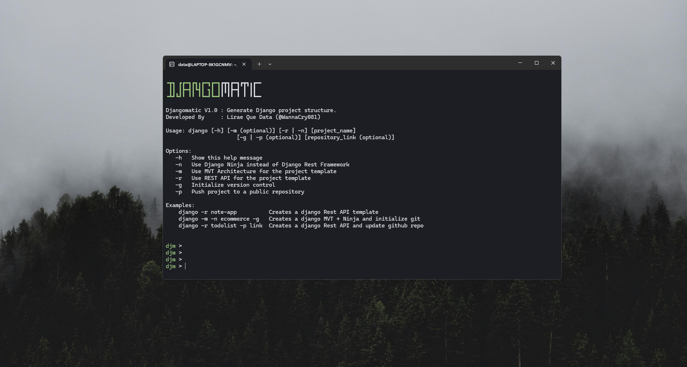

# Djangomatic



Djangomatic is an interactive command-line project structure generator for Django, designed to streamline the process of creating Django projects seamlessly without difficulties. With Djangomatic, users can quickly generate a Django project structure with ease.

## Features

- Interactive command-line interface.
- Simplified project structure generation.
- Seamlessly create Django projects without manual setup.
- Utilizes bash for efficient project creation.

## Project Structures


### DJango-Ninja Template

```bash
project_name
│
├── api
│   ├── __init__.py
│   └── v1
│       ├── admin
│       │   └── __init__.py
│       ├── migrations
│       │   └── __init__.py
│       ├── models
│       │   └── __init__.py
│       ├── exceptions
│       │   └── __init__.py
│       ├── controllers
│       │   └── __init__.py
│       ├── tests
│       │   └── __init__.py
│       ├── utils
│       │   └── __init__.py
│       ├── services
│       │   └── __init__.py
│       ├── repositories
│       │   └── __init__.py
│       ├── __init__.py
│       ├── urls.py
│       └── apps.py         # Needs Configuration
│
├── config
│   ├── __init__.py
│   ├── settings            # Needs Configuration
│   │   ├── __init__.py
│   │   ├── base.py
│   │   ├── production.py
│   │   └── local.py
│   ├── wsgi.py             # Needs Configuration
│   ├── asgi.py             # Needs Configuration
│   └── urls.py
│
├── .env                    # Needs Configuration
├── .gitignore
├── .dockerignore
├── manage.py               # Needs Configuration
├── requirements.txt
├── Dockerfile
└── README.md

```
The project structure outlined above follows a repository pattern. It leverages Django-Ninja as an extension of Django for creating lightweight REST APIs while still utilizing Django’s built-in ORM and maintaining high efficiency.


### Model View Template (MVT) + Rest API Architecture
```bash
project_name
├── api
│   ├── __init__.py
│   └── v1
│       ├── admin
│       │   └── __init__.py
│       ├── migrations
│       │   └── __init__.py
│       ├── models
│       │   └── __init__.py
│       ├── permissions
│       │   └── __init__.py
│       ├── serializers
│       │   └── __init__.py
│       ├── tests
│       │   └── __init__.py
│       ├── utils
│       │   └── __init__.py
│       └── viewsets
│           └── __init__.py
│       ├── __init__.py
│       ├── urls.py
│       └── apps.py         # Needs Configuration
│
├── app
│   ├── admin
│   │   └── __init__.py
│   ├── models
│   │   └── __init__.py
│   ├── tests
│   │   └── __init__.py
│   ├── views
│   │   └── __init__.py
│   ├── forms
│   │   └── __init__.py
│   ├── __init__.py
│   ├── urls.py
│   └── apps.py             # Needs Configuration
│
├── config
│   ├── __init__.py
│   ├── settings            # Needs Configuration
│   │   ├── __init__.py
│   │   ├── base.py
│   │   ├── production.py
│   │   └── local.py
│   ├── wsgi.py             # Needs Configuration
│   ├── asgi.py             # Needs Configuration
│   └── urls.py     
│
├── static
│   ├── js/
│   ├── css/
│   └── images/
│
├── templates
│   └── base.html
│
├── .env                    # Needs Configuration
├── .gitignore
├── .dockerignore
├── manage.py               # Needs Configuration
├── requirements.txt
├── Dockerfile
└── README.md
```
The project structure outlined above provides a REST framework and follows a Model-View-Template (MVT) architecture. The REST API utilizes the Django Rest Framework (DRF) library, which extends Django’s capabilities for building robust APIs. Additionally, I’ve included the MVT architecture to facilitate user views, allowing developers to incorporate HTML Jinja pages if desired.

> [!NOTE]
> 
> To achieve successful migrations and potentially run the code, you’ll need to edit some of the files.


## Installation

To get started with Djangomatic, follow these simple steps:

1. Clone the repository:

```bash
$ git clone https://github.com/WannaCry081/Djangomatic-Bash.git
```

2. Navigate to the directory:

```bash
$ cd djangomatic-bash
```

3. Run the main.sh script:

```bash
# Windows 
$ main.sh

# Linux
$ chmod +x main.sh
$ ./main.sh
```

## Usage

Once you have installed Djangomatic, simply run the main script to start generating your Django project structure. Follow the on-screen instructions to configure your project settings and components. Djangomatic will handle the rest, creating a well-organized Django project for you to work with.

## Contribution

Contributions to Djangomatic are welcome! If you have any ideas, suggestions, or improvements, feel free to open an issue or submit a pull request on the GitHub repository.

---

© 2024 Djangomatic. Developed by [@WannaCry081](https://github.com/WannaCry081).